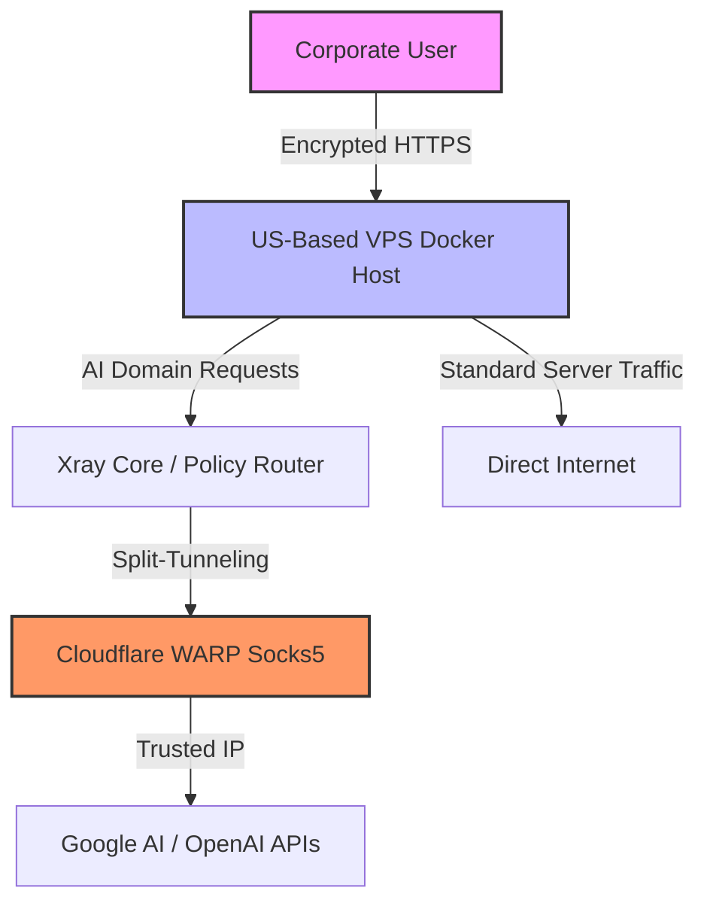

# 🛡️ Secure Corporate AI Gateway (On-Premise Hub)


A resilient, self-hosted AI gateway designed for corporate environments. This architecture provides seamless, geo-unrestricted access to top-tier LLMs (Google AI, OpenAI, Anthropic) without the need for client-side VPNs, while ensuring strict data privacy and zero IP bans.

## 💼 Business Value

* **Zero Data Leaks:** Prompts and chat histories are stored strictly locally within the corporate contour. No public model training on your proprietary code or data.
* **Cost Optimization (FinOps):** Employs advanced split-tunneling. Only AI-bound traffic is proxied, drastically reducing server load and bandwidth costs compared to traditional VPN setups.
* **Frictionless Onboarding:** Developers simply open a web link. No VPN clients to install, no IP configurations, no dropped connections.
* **Bulletproof Uptime:** Utilizes Cloudflare WARP (Socks5) for IP "whitening," effectively bypassing provider paranoia and shadow bans.

## 🏗️ High-Level Architecture

The core of this solution is built on **Policy-Based Routing**. Instead of handling routing at the brittle OS kernel level, we leverage **Xray Core** (managed via 3x-ui) to seamlessly intercept and proxy specific domain requests.


A resilient, self-hosted AI gateway designed for corporate environments. This architecture provides seamless, geo-unrestricted access to top-tier LLMs (Google AI, OpenAI, Anthropic) without the need for client-side VPNs, while ensuring strict data privacy and zero IP bans.

## 💼 Business Value

* **Zero Data Leaks:** Prompts and chat histories are stored strictly locally within the corporate contour. No public model training on your proprietary code or data.
* **Cost Optimization (FinOps):** Employs advanced split-tunneling. Only AI-bound traffic is proxied, drastically reducing server load and bandwidth costs compared to traditional VPN setups.
* **Frictionless Onboarding:** Developers simply open a web link. No VPN clients to install, no IP configurations, no dropped connections.
* **Bulletproof Uptime:** Utilizes Cloudflare WARP (Socks5) for IP "whitening," effectively bypassing provider paranoia and shadow bans.

## 🏗️ High-Level Architecture

The core of this solution is built on **Policy-Based Routing**. Instead of handling routing at the brittle OS kernel level, we leverage **Xray Core** (managed via 3x-ui) to seamlessly intercept and proxy specific domain requests.


🚀 Quick Start (Foolproof Installation)
Prerequisites: A clean Linux VPS (US region recommended) and Docker/Docker Compose installed.

1. Clone the repository:
(Note: Use the copy button on the right of the code block to avoid formatting errors).

```bash
git clone https://github.com/Ubertin0/personal-ai-hub.git
cd personal-ai-hub
```

2. Configure environment variables:
Rename the example environment file and add your specific API keys and UI passwords.

```bash
cp .env.example .env
nano .env
```

3. Deploy the infrastructure:
Spin up the Xray routing core, WARP proxy, and the Chat UI in isolated containers.
```bash
docker-compose up -d
```

🛠️ Technology Stack & Security
Access Control: iptables + fail2ban for base server hardening.

Routing Engine: Xray Core & 3x-ui for dynamic, domain-based split-tunneling.

Proxy Layer: Cloudflare WARP (Socks5 mode) for IP reputation management.

Containerization: Fully dockerized for deterministic deployment and isolation.

Frontend UI: Self-hosted ChatGPT Next Web / Open WebUI instance with RBAC and local storage.

Architected for resilience. Maintained for performance.
